# Multi-Dimensional Bisection Method (MDBM) - Matlab Documentation

**MDBM** is an efficient and robust root-finding algorithm for determining high-dimensional submanifolds of the roots of implicit non-linear equation systems.

[](https://creativecommons.org/licenses/by-nc-nd/2.0/)

---

## 1. Introduction & Quick Start

The Multi-Dimensional Bisection Method extends the classic 1D bisection (interval halving) method to higher dimensions. It is designed to find all solutions to:
$$f_i(x_j) = 0, \quad i=1 \dots k, \quad j=1 \dots l, \quad k \leq l$$

### Quick How-to-Use
1.  **Define Parameter Space (`ax`)**: Define range and initial grid.
    ```matlab
    ax(1).val = linspace(-2, 2, 5);
    ax(2).val = linspace(-2, 2, 5);
    ```
2.  **Define the Function**:
    ```matlab
    fun = @(x) x(1,:).^2 + x(2,:).^2 - 1; 
    ```
3.  **Run MDBM**:
    ```matlab
    sol = mdbm(ax, fun, 4);
    ```
4.  **Visualize**: `plot_mdbm(sol);`

---

## 2. Detailed Options (`mdbmset`)

The `mdbmset` function creates the options structure. Each field is critical for fine-tuning the solver's performance and robustness.

| Field | Description | Related Demonstration |
| :--- | :--- | :--- |
| `fvectorized` | (Always true) Assumes the function accepts and returns matrices of points for speed. | - |
| `isconstrained` | If true, the last equation in the output is treated as a domain boundary. Solutions are only kept where this value is positive. | `features/constrained_problems_simple.m` |
| `interporder` | Order of root interpolation: `0` (raw grid points), `1` (linear), `2` (quadratic). Higher orders provide smoother results but require more neighbors. | `features/interpolation_order.m` |
| `bracketingdistance` | Distance (in grid units) to look for sign changes. Increasing this can help recover branches in very dense solution regions. | `case_studies/turning_stability/...` |
| `bracketingnorm` | The norm used to calculate distance for bracketing. | - |
| `checkneighbourinallsteps` | If true, neighbor checking is performed at every iteration. Highly robust but slower. | `features/neighbor_check_demo.m` |
| `checkneighbour` | Maximum number of consecutive neighbor check steps. Set to `Inf` for maximum robustness or `0` to disable. | `features/neighbor_check_demo.m` |
| `directionalneighbouronly` | Optimization: if true, only neighbors in directions where a root is expected are checked. | - |
| `connections` | If true, calculates the Delaunay connectivity needed for plotting surfaces and curves. | `features/connection_of_points_to_simplex.m` |
| `zerotreshold` | Numerical value below which a function evaluation is considered exactly zero. Essential for degenerate or non-smooth functions. | `features/degenerate_function_1.m` |
| `cornerneighbours` | If true, includes diagonal (corner) neighbors in the search, not just face neighbors. Required for `interporder > 1`. | `features/interpolation_order.m` |
| `refinetype` | Refinement strategy: `'all'` (standard bisection), `'pos'` (refine specific coordinate range), `'object'` (refine near detected roots), `'curvature'`. | `features/local_refinement_nonsmooth_mandelbrot.m` |
| `Ncodim` | Manually specify the number of equations if it cannot be determined automatically. | - |
| `timelimit` | Maximum allowed time (seconds) for a single refinement step. Prevents excessive computation in complex regions. | `case_studies/Delay_Mathieu...` |
| `funcallimit` | Maximum number of function evaluations allowed to prevent memory overflow. | - |

---

## 3. Core Engine Files (`src`)

A detailed breakdown of the files in the `src` directory:

| File | Description |
| :--- | :--- |
| `mdbm.p` | **Main Entry Point**. Orchestrates the iterative bisection, calling refinement and interpolation logic. |
| `mdbmset.m` | **Configuration**. Utility to create the options structure with sensible defaults. |
| `plot_mdbm.m` | **Primary Visualization**. Intelligent plotting for 1D, 2D, and 3D submanifolds. Handles scaling and color-mapping. |
| `extend_axis.m` | **Domain Extension**. Adds new parameter ranges to an existing solution, allowing for "continuation" into unknown territory. |
| `refine.p` | **Grid Management**. Implements the various refinement strategies (splitting cells into sub-cells). |
| `checkneighbour.p` | **Robustness Engine**. Scans adjacent grid cells to find missing solution branches that the standard bisection might have missed. |
| `interpolating_cubes.p` | **Root Finder**. Performs the actual interpolation (0th, 1st, or 2nd order) to locate the root inside a grid cell. |
| `DTconnect.p` | **Meshing (Standard)**. Generates the Delaunay triangulation/connection logic for visualizing submanifolds. |
| `DTconnect_delunay_high_order.p` | **Meshing (Advanced)**. More robust connection logic for complex or higher-dimensional manifolds. |
| `interpplot.p` | **Visual Smoothing**. Generates high-quality smooth interpolation specifically for the plotting engine. |
| `plotthecomputedpoints.m` | **Debug Visualization**. Useful for seeing exactly which grid points were evaluated by the solver. |
| `mdbm_variax_wrapper.m` | **Parameter Sweep Wrapper**. Helper for running MDBM over variations of parameters (used in envelope sweeping). |
| `axdoubling.p` | **Internal**. Logic for doubling axis resolution during refinement. |
| `axialpos.p` | **Internal**. Converts grid indices to physical coordinates in the parameter space. |
| `db_combnk.p` | **Internal**. Combinatorial utility for high-dimensional grid indexing. |
| `evalmissingnodes.p` | **Internal**. Identifies and evaluates grid nodes that were skipped in previous iterations. |
| `getncubeval.p` | **Internal**. Retrieves the function values at the vertices of an n-dimensional hypercube. |
| `getneithbours.p` | **Internal**. Identifies neighboring cells in the n-dimensional grid. |
| `ind2sub_mdbm.p` | **Internal**. Optimized index-to-subscript conversion for MDBM structures. |
| `sub2ind_mdbm.p` | **Internal**. Optimized subscript-to-index conversion for MDBM structures. |
| `timelength_check.p` | **Internal**. Performance monitoring used to enforce `timelimit`. |

---

## 4. Folder Descriptions & Gallery

### `templates/`
Boilerplate scripts for various parameter/equation combinations. Use these to jump-start your project.
*   *Example:* `template_pardim2_codim1.m` for finding a curve in a 2D plane.

### `features/`
Demonstrations of specific solver capabilities and options.

#### Simplex Connections
`connection_of_points_to_simplex.m` shows how points are joined into a mesh.
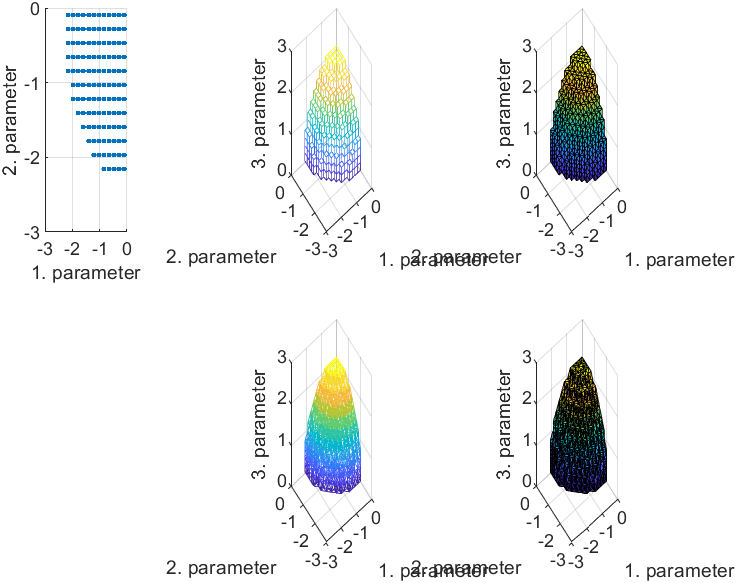

#### Constrained Problems
`constrained_problems_simple.m` (and `complex.m`) show how to limit the solution domain using a constraint function (positive values are kept).
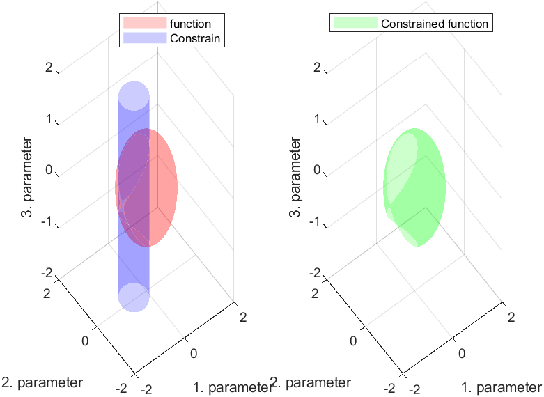
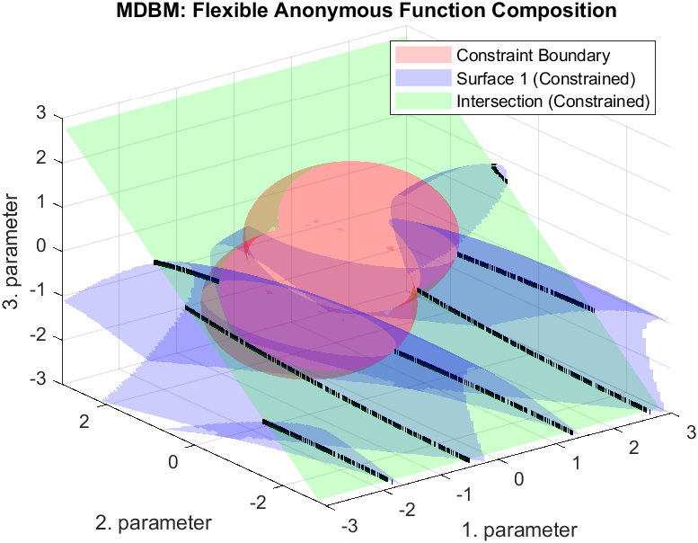

#### Interpolation Order
`interpolation_order.m` demonstrates the convergence and accuracy of 0th, 1st, and 2nd order interpolation.
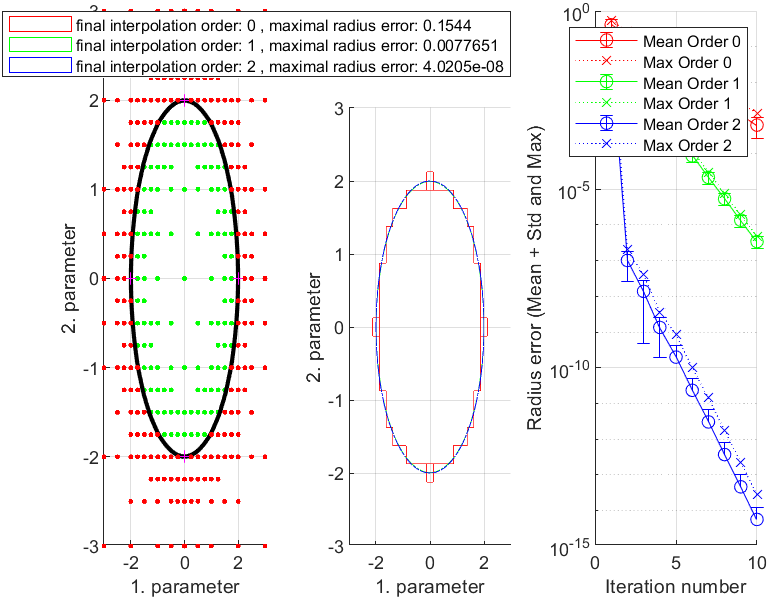

#### Local Refinement
`local_refinement_nonsmooth_mandelbrot.m` shows how to increase resolution in a specific area.
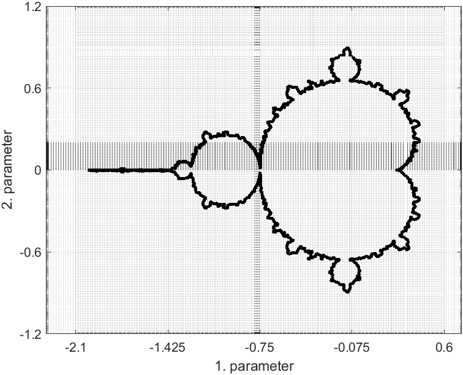

#### Neighbor Check
`neighbor_check_demo.m` illustrates how MDBM recovers missing solution branches by checking adjacent cells.
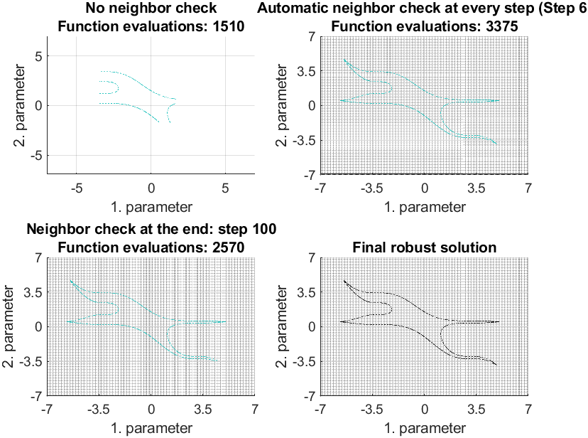

### `examples/`
Practical and visual applications.

#### Unit Circles
`unit_circles.m`: Visualization of $L^p$ norms in 3D.
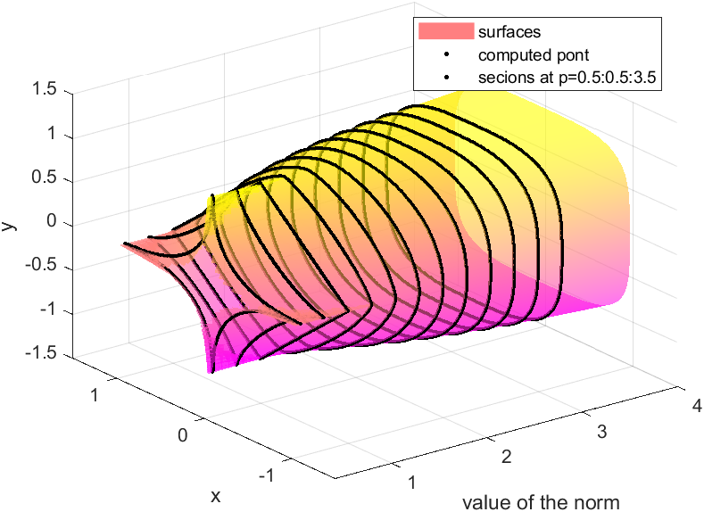

#### Julia Set 3D
`julia_set_3d.m`: Fractal boundaries in 3D space.
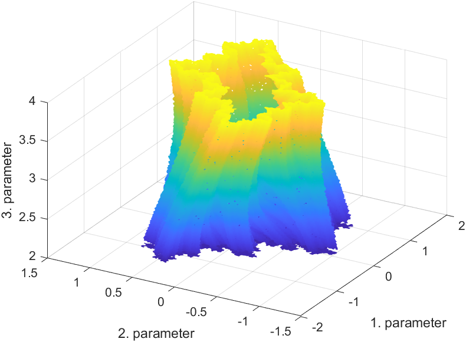

#### Catastrophe Surface
`catastrophe_surface_visualization_gradient.m`: Visualization of critical points.
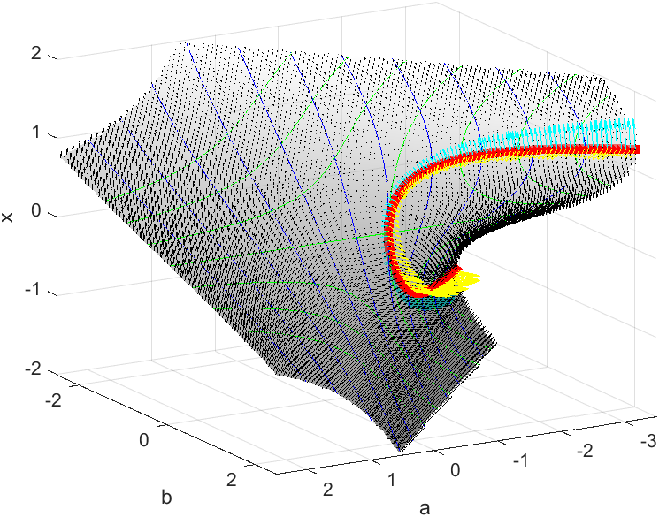

#### Stability Analysis
`delayed_pd_controler_stability.m`: Stability regions for a delayed PD controller.
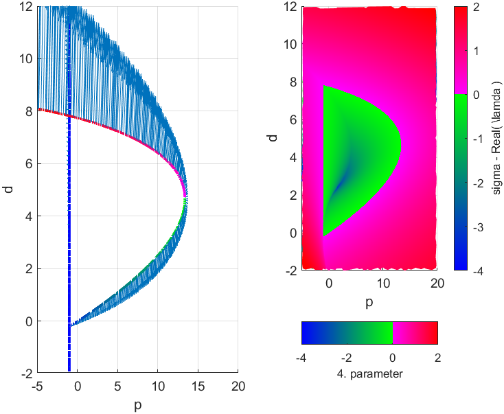

#### Noise Handling
`noise_handeling.m`: Robustness against noisy function evaluations.
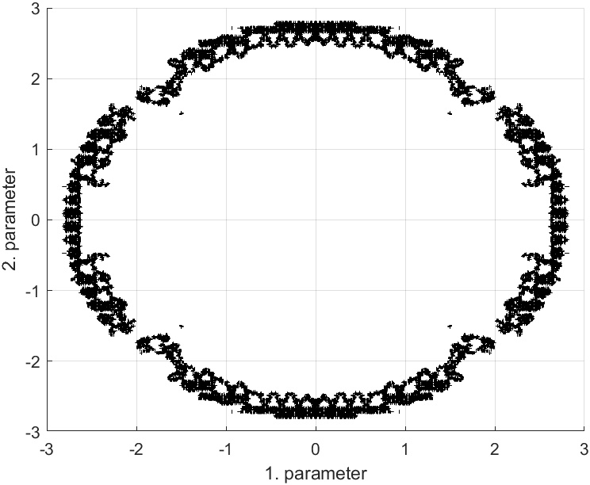

### `case_studies/`
Replication of scientific problems.

#### Shimmy Problem
`shimmy_stability_surface.m`: Lateral vibration stability of wheels.
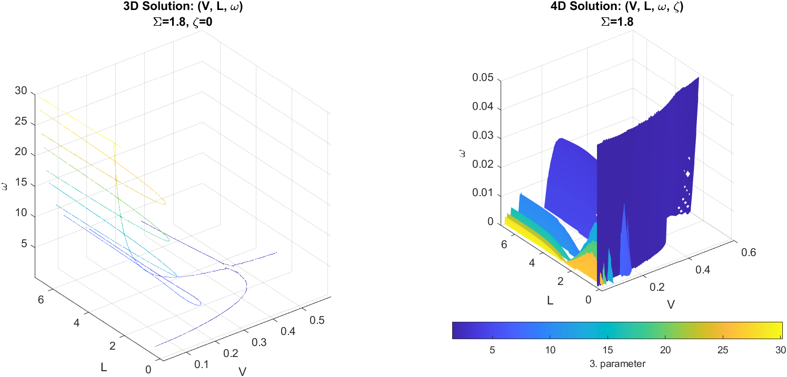

#### Turning Stability
`turning_stability_instabilitygradient.m`: Stability charts for machining processes.
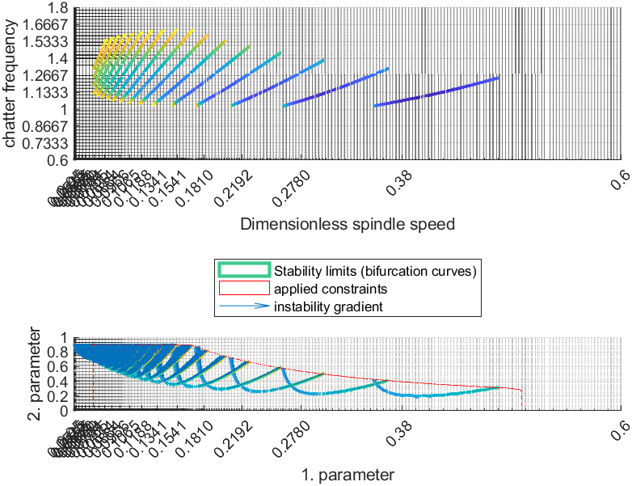

---

## 5. History & Background

The core idea of MDBM occurred during my MSc thesis (written during an Erasmus stay at the **University of Bristol**) in **2006**. The primary motivation was solving the characteristic equations of **Delay Differential Equations (DDEs)**, which typically involve $2+1$ parameters and 2 equations (real/imaginary parts). MDBM remains unique in its ability to handle these challenges robustly without requiring derivatives.

---

## 6. Known Alternatives

*   **Mathematica (ContourPlot/Isosurface)**: Mathematica uses an iterative refinement method (triangle-based) for its visualization functions. While robust and supporting 3D, it is generally limited to a single implicit equation.
*   **Sequential Projection / Triangulation**: These methods solve the equations one by one. For example, finding the zero level set of the first equation, triangulating it, and then searching for the zeros of the second equation on those triangles. While mathematically sound, the complexity scales poorly, often becoming as expensive as a brute-force search.
*   **Interval Arithmetic (Guaranteed Solutions)**: Methods based on Interval Arithmetic (IA) provide mathematically guaranteed enclosures of the roots. **David P. Sanders** has developed significant work in this area (e.g., `IntervalRootFinding.jl` in Julia). These methods are excellent for finding *all* roots with certainty, whereas MDBM might lose small features if the initial grid is too coarse. However, IA methods can be more complex to set up for general black-box engineering functions.
*   **Newton-Raphson & Continuation Methods**: Standard local solvers are much faster if a good initial guess is available but cannot easily find all branches or handle non-differentiable manifolds as robustly as MDBM.

---

## 7. Disclaimer & Versions

**Note on Protected Files**: The core engine (`mdbm.p`, `refine.p`, etc.) is provided as protected files. All user-customizable files are `*.m`.

**Julia Version**: A newer version is available in Julia, featuring **sub-cube interpolation** and **error-based non-uniform refinement**. It is currently the focus of active development.

---

## 8. Citing

If you use this software in your research, please cite:
> **Bachrathy, Daniel, and Gabor Stepan.** "Bisection Method in Higher Dimensions and the Efficiency Number." *Periodica Polytechnica Mechanical Engineering*, vol. 56, no. 2, 2012, p. 81. [doi:10.3311/pp.me.2012-2.01](https://doi.org/10.3311/pp.me.2012-2.01)
